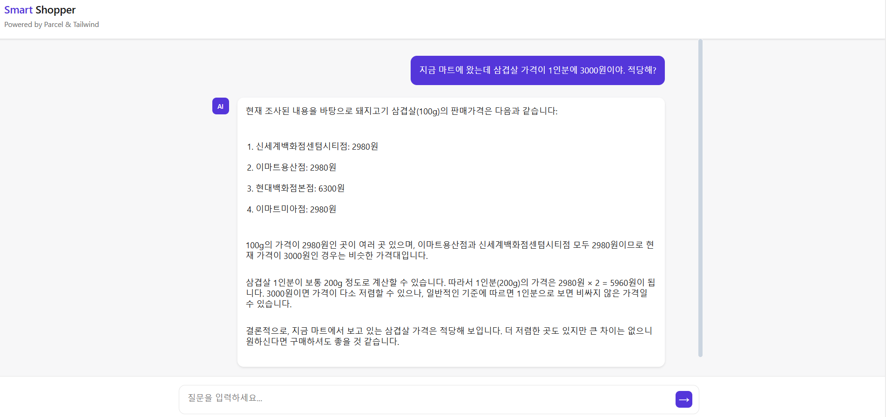

# 마트 쇼핑 도우미 챗봇 (SmartShopper)

 

## 👥 팀원 소개

| **Name** |   박성욱   |   손서현   | 송명석  | 신동욱  | 한승남 |
| :------: | :--------: | :--------: | :----: | :----: | :----: |
| **역할** |  자료제작 데이터 수집 | 프론트엔드 개발 디자인 | 데이터 임베딩 백엔드 개발 | 자료제작 팀장 RAG 파이프라인 설계  | 백엔드 개발 RAG 파이프라인 설계 |
 

## 서비스 개요
### 1. 서비스가 해결하려는 문제점(Problem Statement)
소비자가 마트에서 상품을 구입할 때, 동일 상품에 대한 다른 마트의 가격정보를 알지 못하여 해당 상품의 가격이 적절한지, 합리적인 소비인지 알기 어렵다.

### 2. 제공하고자 하는 주요 기능 및 가치  
- 실시간 가격 비교 및 가성비 평가
- 할인 정보 제공

### 3. 타겟 사용자와 예상 사용 시나리오  
타겟 사용자 : 가격 민감도가 높은 일반 소비자 및 식재료 구입을 자주하는 주부 
예상 시나리오 : 사용자가 특정 상품의 가격을 입력하거나 검색하면, 최적의 가격과 가성비 분석 결과를 제공  

 

## 목표 및 기대효과
### 서비스 목표
- 사용자 질문에 신속하고 정확한 답변을 제공하여 문제 해결 시간을 단축
- 사용자에게 실시간 가격 정보와 가성비 분석을 제공하여 현명한 소비를 지원  
- 마트별 할인 정보를 제공하여 사용자 선택의 폭을 넓힘  

### 기대효과
- 가성비 높은 구매 경험 제공  
- 합리적인 소비 문화 정착과 마트의 경쟁력 강화 지원  

 

## 타겟 사용자

|구분|내용|
|-|-|
|예상 사용자 유형|일반 소비자, 쇼핑 애호가, 주부, 대학생 등|
|주요 요구사항|실시간 가격 비교, 가성비 분석|

 

## 사용법 - User
### 1. <a href="https://master.d1kqzz90ejyhk5.amplifyapp.com/"> Smart shopper에 접속하세요 </a>
### 2. 질문을 입력하세요.  
    예시) "지금 마트에 왔는데 삼겹살 가격이 1인분에 3000원이야. 적당해?"

### 3. 답변을 통해 의사 결정에 활용하세요!

 

## 사용법 -Local
### 1. 백엔드 : `app.py -> uvicorn app:app --reload`
### 2. 프론트엔드 : `npm run start`

 
 
 

"아래는 구현에 관한 내용입니다."
 
 
 

## 데이터 소스 및 형식
### 원천데이터 소스
- 공공데이터 [한국소비자원_생필품 가격 정보_20241220] 활용  
https://www.data.go.kr/data/15083256/fileData.do

### 원천데이터 형식
- 정형 데이터 : csv    

 

## RAG 파이프라인 설계
|구분|내용|
|-|-|
|데이터 최적화|chunk size : 100 / Overlap : 100|
|벡터 DB|Pinecone|
|임베딩 모델|OpenAI Embeddings|
|하이퍼 파라미터|top-k = 5 / 유사도 임계값 = 0.7|

 

## 🛠️ 구현

|구분|내용|
|-|-|
|프론트|HTML / JavaScript / Tailwind CSS / Parcel|
|백엔드|Python / FastAPI|
|배포|Fly.io / AWS Amplify|

## 성능
테스트케이스 **50개 중 42개**에 대한 정확한 답변을 얻었습니다.
|테스트 케이스|정답여부|비고|
|-|-|-|
|"밀가루 가격 얼마가 적당해?"|O|여러 지점의 가격을 알려주고 최저가를 알려줌|
|"콜라가 가장 저렴한 곳은 어디야?"|O|여러 지점의 가격을 알려주고 최저가를 알려줌|
|"삼다수 가장 저렴한 곳이 어디야"|O|여러 지점의 가격을 알려주고 최저가를 알려줌|
|"삼겹살 가격 알려줘"|O|여러 지점의 가격을 알려주고 최저가를 알려줌|
|"참 크래커 얼마가 적당해?|O|여러 지점의 가격을 알려주고 최저가를 알려줌|
|"빼빼로 얼마가 적당해?|X|데이터가 없음|
|...|..|..|

 

## 향후 
### 1. 위치 기반 서비스
- 사용자 위치 정보 활용
- 가까운 오프라인 매장 분석
- 실시간 최적 구매장소 추천
- 개인화된 쇼핑 경험 제공

### 2. 원산지별 가격
- 상품별 원산지 정보 제공
- 원산지에 따른 가격 비교
- 품질 대비 가격 분석
- 계절별 최적 원산지 추천
- 원산지 선호도 반영

### 3. 야간 할인 정보
- 마트별 야간 할인 정보 수집
- 실시간 할인 알림 서비스
- 시간대별 가격 변동 분석
- 최적 구매 시점 추천
- 재고 소진 예측 기능
- 사용자 맞춤 알림 설정

